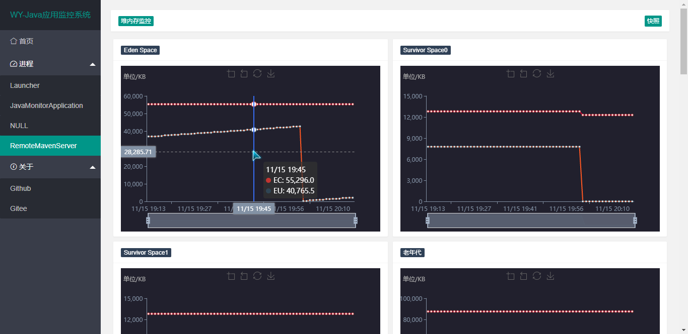
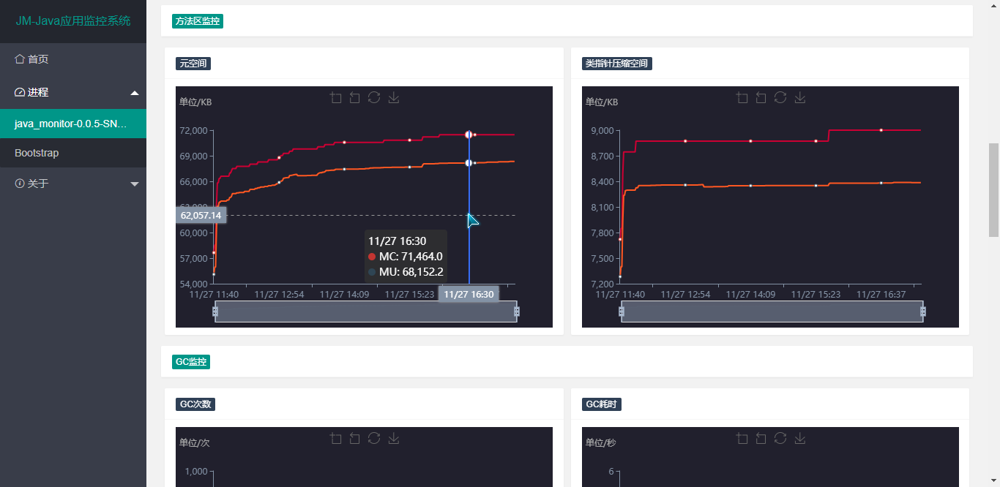
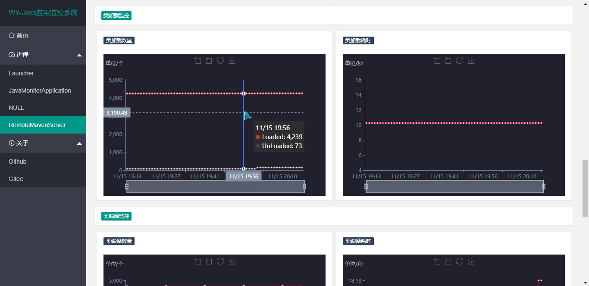
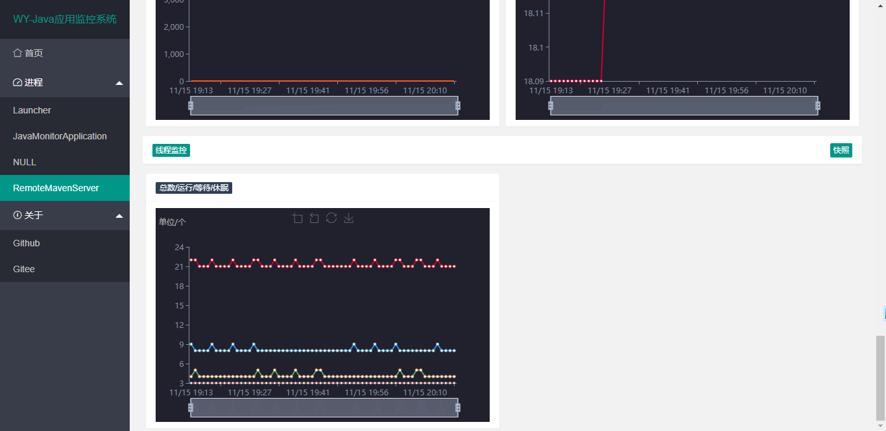

# Java应用性能监控系统（WY）

## 1.简介

WY（Java应用监控系统）是基于Java8制作而成的一款在线监控系统。

WY适用于监控所有Java应用，具有堆内存监控、方法区监控、GC监控、类加载监控、类编译监控与线程监控等，提供堆快照下载，线程快照下载等功能。

WY的使用非常简单，只需要把它扔在你的服务器上执行即可，它会立即检测当前机器上的所有Java应用并进行监控。

WY使用webSocket建立客户端与服务端通信，大大降低了客户端流量与服务器负载。

## 2.说明

基于Java8开发，低于Java8不支持

## 3.下载使用

下载项目Jar包直接执行即可

```
java -jar java_monitor-0.0.x-SNAPSHOT.jar
```


启动成功后默认访问端口8888

## 4.运行界面










## 5.自定义端口

在执行jar包时追加参数

```
--server.port=9999
```

## 6.自定义监控周期

默认监控频率为60秒，并且只记录当天产生的监控数据。

如果需要自定义监控频率与监控时长，只需要在jar包所在目录下新建application.properties文件，修改下列字段即可

```
monitor.rate=60 #监控频率/秒
monitor.cron=0 0 0 * * ? #每日的0:00:00时刻清空数据
```

连续监控1个月，示例

```
monitor.cron=0 0 0 1 * ?
```

连续监控1年，示例

```
monitor.cron=0 0 0 1 1 ? *
```

不新建文件，使用追加参数的方法也是可以的。

## 7.监控参数

监控参数的含义如下：

- S0C：s0（from）的大小（KB）

- S1C：s1（from）的大小（KB）

- S0U：s0（from）已使用的空间（KB）

- S1U：s1(from)已经使用的空间(KB)

- EC：eden区的大小(KB)

- EU：eden区已经使用的空间(KB)

- OC：老年代大小(KB)

- OU：老年代已经使用的空间(KB)

- MC：元空间的大小（Metaspace）

- MU：元空间已使用大小（KB）

- CCSC：压缩类空间大小（compressed class space）

- CCSU：压缩类空间已使用大小（KB）

- YGC：新生代gc次数

- YGCT：新生代gc耗时（秒）

- FGC：Full gc次数

- FGCT：Full gc耗时（秒）

- GCT：gc总耗时（秒）

- Loaded：表示载入了类的数量

- Unloaded：表示卸载类的数量

- Compiled：表示编译任务执行的次数

- Failed：表示编译失败的次数

- Total：线程总数

- Runnable：正在运行的线程数

- Sleeping：休眠的线程数

- Waiting：等待的线程数

## 8.技术栈

| Maven                 | layui           |
| --------------------- | --------------- |
| Spring Boot 2.0       | Spring data jpa |
| spring boot websocket | H2 (DataBase)   |
| Quartz                | lombok          |
| Thymeleaf             | ECharts 3       |

## 9.更新日志

2018-11-14：

- 正式发布

2018-11-15：

- 新增堆快照、线程快照下载

- 修复下载堆快照找不到文件的bug

- 数据库文件转储至~/wyDataBase/目录下，Linux为~目录下，Windows目录为C:\Users\Administrator

- 解决socket客户端连接bug

- 重构客户端页面

2018-11-16：

- 新增类加载大小监控

- 新增设置客户端通信频率


## 10.关于作者

*我的博客：[https://yueshutong.cnblogs.com/](https://yueshutong.cnblogs.com/)*

*Github：[https://github.com/yueshutong/JavaMonitor](https://github.com/yueshutong/JavaMonitor)*

*Gitee：[https://gitee.com/zyzpp/JavaMonitor](https://gitee.com/zyzpp/JavaMonitor)*